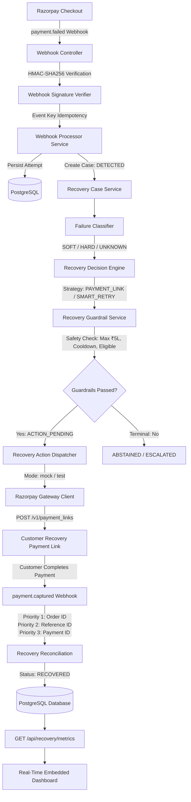

# RazorRecall
> **Autonomous Payment Recovery Intelligence for Razorpay**<br>
> *Built for the Razorpay AI Buildathon*

---

## 1. Problem
Checkout drop-offs, transient network drops, customer friction, and bank downtime account for **15–30% of lost e-commerce revenue**. Traditional recovery mechanisms are crude:
- Blind, immediate retries aggravate user frustration and trip fraud filters.
- Generic blast emails/SMS nudges arrive hours late with dead links.
- Merchants lack automated, guardrailed reconciliation that correlates secondary recovery payments back to the original lost order.

## 2. Solution
**RazorRecall** is an autonomous, deterministic payment recovery engine built natively around Razorpay's payment rails. It intercepts `payment.failed` webhook events in real-time, diagnoses failure patterns, executes safety guardrails, generates dynamic Razorpay Payment Links, and automatically reconciles `payment.captured` webhooks to close the loop and recover revenue.

---

## 3. Architecture



---

## 4. Recovery State Machine

RazorRecall enforces a deterministic, 7-state lifecycle with strict transition safety:

```
[DETECTED]
    │
    ▼ (Evaluate: Failure Classification + Policy Rules)
[ACTION_PENDING] ────► [ABSTAINED] (Terminal: Hard failure / Invalid)
    │            ────► [ESCALATED] (Terminal: Anomaly / Fraud review)
    ▼ (Dispatch: Guardrails + Cooldown validation)
[WAITING_FOR_OUTCOME] ──► [ACTION_FAILED] (Gateway outage / Transport error)
    │
    ▼ (Reconcile: payment.captured Webhook 3-tier match)
[RECOVERED] (Terminal Success)
```

- **`DETECTED`**: Initial state recorded immediately upon valid `payment.failed` webhook.
- **`ACTION_PENDING`**: Soft failure verified, recovery strategy selected, policy approved.
- **`WAITING_FOR_OUTCOME`**: Gateway payment link generated or retry launched.
- **`RECOVERED`**: Payment successfully captured and correlated; revenue recovered.
- **`ABSTAINED`**: Non-recoverable failure (e.g. invalid card number, fraud decline).
- **`ESCALATED`**: Value exceeds guardrail limits or requires human merchant review.
- **`ACTION_FAILED`**: Gateway returned transport error or 5xx outage.

---

## 5. Technology Stack

- **Runtime**: Java 21 LTS
- **Framework**: Spring Boot 4.1.1 (Spring Framework 7)
- **Persistence**: Spring Data JPA / Hibernate 7
- **Database**: PostgreSQL 16+
- **Schema Management**: Flyway Migrations (V1–V6 strictly frozen)
- **JSON Processing**: Jackson 3 (`tools.jackson`)
- **HTTP Transport**: Native Java 21 `java.net.http.HttpClient`
- **Dashboard UI**: HTML5, Vanilla CSS, Browser Fetch API (Zero external npm/CDN dependencies)
- **Build System**: Apache Maven (via `./mvnw` wrapper)

---

## 6. Quick Start

### Step 1: Start PostgreSQL
Ensure PostgreSQL is running locally on port `5432` with database `razorrecall`:

```bash
# Option A: Run via Docker
docker run -d --name razorrecall-postgres \
  -p 5432:5432 \
  -e POSTGRES_DB=razorrecall \
  -e POSTGRES_USER=sunny. \
  -e POSTGRES_HOST_AUTH_METHOD=trust \
  postgres:16-alpine

# Option B: Run locally on native PostgreSQL
createdb razorrecall
```

### Step 2: Build & Start Application
```bash
# Run application (Flyway automatically migrates V1-V6 on boot)
./mvnw spring-boot:run
```
*The server starts on `http://localhost:8080` with the deterministic Mock Gateway active by default.*

---

## 7. Automated Demo Runner

To run the complete 14-stage recovery lifecycle in **5 seconds** without manual HMAC-SHA256 calculation:

```bash
chmod +x demo.sh
./demo.sh
```

### What `./demo.sh` Demonstrates:
1. **Verifies Health**: Pings `/actuator/health` to confirm server readiness.
2. **Generates & Signs `payment.failed`**: Ingests checkout drop-off failure with valid HMAC-SHA256 signature.
3. **Validates Detection**: Asserts case created in `DETECTED` status with `SOFT` classification.
4. **Triggers Evaluation**: Validates guardrails and advances case to `ACTION_PENDING`.
5. **Dispatches Gateway Action**: Generates a Razorpay payment link and transitions case to `WAITING_FOR_OUTCOME`.
6. **Simulates Recovery Payment**: Ingests `payment.captured` webhook carrying `recovery_case_id` in notes.
7. **Reconciles Lifecycle**: Matches correlation priority, updates case to `RECOVERED`, marks attempt `CAPTURED`.
8. **Live Metrics**: Queries `GET /api/recovery/metrics` and prints recovered revenue and recovery rate.

---

## 8. Embedded Visual Dashboard

Open your browser to:
```
http://localhost:8080/
```

- **Real-Time Recovery Metrics**: Recovered Revenue, Recovery Rate %, At-Risk Revenue, Active Cases.
- **Interactive State Diagram**: Visualizes `DETECTED` → `ACTION_PENDING` → `WAITING_FOR_OUTCOME` → `RECOVERED`.
- **Live Cases Table**: Auto-refreshes every 4 seconds to reflect case transitions in real time.
- **Direct Controls**: Trigger batch evaluation (`/evaluate-detected`) and batch dispatch (`/dispatch-due`) from the UI.

---

## 9. API Reference

| Method | Endpoint | Description |
| :--- | :--- | :--- |
| `POST` | `/api/webhooks/razorpay` | Ingests Razorpay webhook events (`payment.failed`, `payment.captured`). Requires `X-Razorpay-Signature`. |
| `GET` | `/api/recovery/cases` | Lists all recovery cases. Supports `?status=...` and `?eligible=...` query filters. |
| `GET` | `/api/recovery/cases/{id}` | Retrieves detailed recovery case record and associated payment attempt. |
| `POST` | `/api/recovery/cases/{id}/evaluate` | Evaluates a single `DETECTED` case against failure rules and guardrails. |
| `POST` | `/api/recovery/cases/evaluate-detected` | Batch evaluates all un-evaluated `DETECTED` cases. |
| `POST` | `/api/recovery/cases/{id}/dispatch` | Dispatches recovery action to gateway (`?force=true` bypasses timing cooldown). |
| `POST` | `/api/recovery/cases/dispatch-due` | Batch dispatches all matured `ACTION_PENDING` cases. |
| `GET` | `/api/recovery/metrics` | Returns live recovery analytics (total recovered amount, rate %, case counts). |
| `GET` | `/actuator/health` | Standard Spring Boot Actuator application health endpoint. |

---

## 10. Razorpay Gateway Modes

RazorRecall features dual-mode gateway operation configured in `src/main/resources/application.yaml`:

```yaml
razorrecall:
  razorpay:
    mode: ${RAZORPAY_MODE:mock}                      # 'mock' (default) or 'test'
    key-id: ${RAZORPAY_KEY_ID:rzp_test_dummy}
    key-secret: ${RAZORPAY_KEY_SECRET:dummy_secret}
    base-url: ${RAZORPAY_BASE_URL:https://api.razorpay.com}
```

- **`mock` Mode (Default)**:
  - Completely offline and deterministic.
  - Generates synthetic `plink_xxx` IDs and `https://rzp.io/i/xxx` links via SHA-256 hashing.
  - Zero external network calls; powers automated tests and standalone demos.
- **`test` Mode (Razorpay Sandbox)**:
  - Set `RAZORPAY_MODE=test`, `RAZORPAY_KEY_ID=rzp_test_...`, `RAZORPAY_KEY_SECRET=...`.
  - Makes live HTTPS calls to `https://api.razorpay.com/v1/payment_links` using Basic Auth.
  - *Never use live production credentials for hackathon demos.*

---

## 11. Security & Guardrails

- **Cryptographic Signature Verification**: Every incoming webhook is verified against `X-Razorpay-Signature` using constant-time HMAC-SHA256 comparisons (`MessageDigest.isEqual`) to prevent timing attacks.
- **Atomic Idempotency**: Webhook events are indexed by `eventType:paymentId` on the database level (`ux_webhook_events_event_key`), ensuring zero duplicate case creation or double-reconciliation.
- **Max Recovery Threshold**: Guardrail strictly enforces maximum recovery transaction limit (default: ₹5,00,000.00 INR).
- **Currency Whitelist**: Rejects non-INR transactions from automated dispatch.
- **Zero Credential Leaks**: Authorization headers, token bytes, and API secrets are never printed in logs or exception messages.

---

## 12. Database & Migrations

- Managed via Flyway in `src/main/resources/db/migration/`:
  - `V1__initial_schema.sql`: `merchants` and `payment_attempts` tables.
  - `V2__add_webhook_events.sql`: `webhook_events` table.
  - `V3__add_recovery_cases.sql`: `recovery_cases` table.
  - `V4__add_event_type_to_webhook_events.sql`: Webhook event type tracking.
  - `V5__add_payload_to_webhook_events.sql`: Webhook raw payload auditing.
  - `V6__add_webhook_event_key.sql`: Unique constraint for idempotency.
- **Schema is strictly frozen**: **Zero V7 migrations permitted.**

---

## 13. Test Verification

The entire codebase is validated by **79 unit, integration, and lifecycle tests**:

```bash
./mvnw test
```

```
[INFO] Results:
[INFO]
[INFO] Tests run: 79, Failures: 0, Errors: 0, Skipped: 0
[INFO]
[INFO] BUILD SUCCESS
```

- **72 Baseline Tests**: Webhook ingestion, signature verification, classification, guardrails, dispatch, reconciliation, and end-to-end integration.
- **7 Block 7 Tests**: Real HTTP client transport, Basic Auth header validation, response parsing, error redaction, and conditional gateway bean resolution.

---

## 14. Demo Flow Summary

```
payment.failed (Checkout Drop-Off)
       ↓
Webhook Verified & Idempotent Case Created (DETECTED)
       ↓
Failure Classified (SOFT) & Decision Formulated (PAYMENT_LINK)
       ↓
Guardrails Validated (Amount ≤ ₹5L, Eligibility True)
       ↓
Recovery Action Dispatched (WAITING_FOR_OUTCOME)
       ↓
Razorpay Payment Link Generated (https://rzp.io/i/...)
       ↓
Customer Completes Payment via Link
       ↓
payment.captured Webhook Received
       ↓
3-Tier Reconciliation Matches Order & Reference ID
       ↓
Case Transitions to RECOVERED & Attempt Marked CAPTURED
       ↓
Real-Time Metrics Updated: Recovered Revenue & Recovery Rate %
```

---

## 15. Project Status
- **Blocks 1–5**: Core Webhook Ingestion, Classification, Guardrails, Dispatch, Reconciliation & Metrics (**COMPLETE & FROZEN**).
- **Block 6**: End-to-End Recovery Lifecycle Integration (**COMPLETE & FROZEN**).
- **Block 7**: Real Razorpay Test Mode Gateway Adapter (**COMPLETE & FROZEN**).
- **Block 8**: Turnkey Demo Runner (`demo.sh`), Embedded Web Dashboard, and Submission Documentation (**COMPLETE & VERIFIED**).
