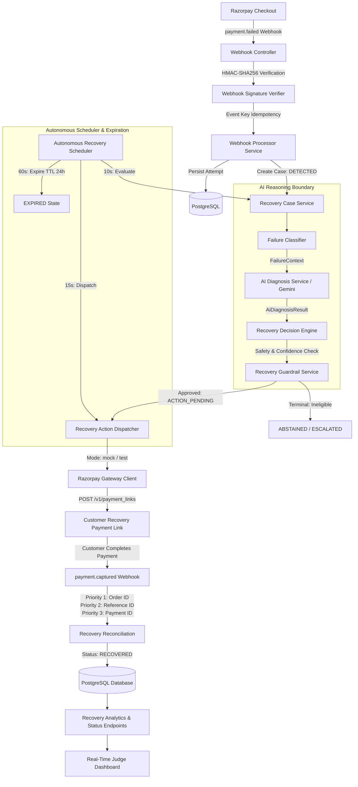

# RazorRecall
> **Autonomous Payment Recovery Intelligence for Razorpay**<br>
> *Built for the Razorpay AI Buildathon*

---

## 1. Executive Summary & Problem

Checkout drop-offs, transient network drops, 3DS authentication timeouts, customer hesitation, and bank downtime account for **15–30% of lost e-commerce revenue**.

Traditional recovery mechanisms fail because:
- **Blind retries**: Immediate automated re-attempts annoy customers and trigger fraud/risk filters.
- **Disconnected notification blasts**: Email or SMS reminders arrive hours later with stale checkout links or wrong amounts.
- **Unreconciled payments**: Merchants lack automated correlation between secondary recovery payments and the original failed order, leading to double-shipping or broken order states.
- **Unchecked AI risk**: Relying entirely on probabilistic LLMs to initiate financial actions introduces hallucinations, compliance failures, and monetary loss.

**RazorRecall** solves this through an **autonomous, guardrailed payment recovery system** integrated directly with Razorpay's payment rails. It intercepts `payment.failed` webhooks in real-time, leverages advisory AI reasoning (Gemini) with deterministic safety guardrails, dispatches targeted Razorpay Payment Links, executes an autonomous scheduler lifecycle, and automatically reconciles `payment.captured` webhooks to recover lost revenue.

---

## 2. Core Design Principle: The AI Reasoning Boundary

RazorRecall enforces a strict architectural boundary: **AI proposes; the backend validates; guardrails decide; the system executes.**

```
┌─────────────────────────────────────────────────────────────┐
│ 1. AI ADVISORY LAYER (Gemini / Deterministic Fallback)       │
│    - Evaluates raw failure reason, code, description, amount │
│    - Proposes strategy (PAYMENT_LINK, SMART_RETRY, etc.)    │
│    - Assigns confidence score (0.0 to 1.0) & explanation    │
└──────────────────────────────┬──────────────────────────────┘
                               │ (Proposal)
                               ▼
┌─────────────────────────────────────────────────────────────┐
│ 2. BACKEND VALIDATION LAYER (Authoritative Domain Rules)     │
│    - Rejects low-confidence proposals (< 0.60 threshold)    │
│    - Hard terminal failures (e.g. invalid card) -> ABSTAIN  │
│    - Anomalous or unclassified patterns -> MANUAL_ESCALATE  │
│    - Overrides AI if domain constraints violated            │
└──────────────────────────────┬──────────────────────────────┘
                               │ (Validated Strategy)
                               ▼
┌─────────────────────────────────────────────────────────────┐
│ 3. DETERMINISTIC GUARDRAILS (RecoveryGuardrailService)       │
│    - Value ceiling check (Max: ₹5,00,000.00 INR)            │
│    - Currency whitelist (Enforces INR)                      │
│    - Cooldown & duplicate attempt suppression               │
│    - Eligibility verification                               │
└──────────────────────────────┬──────────────────────────────┘
                               │ (Approved Action)
                               ▼
┌─────────────────────────────────────────────────────────────┐
│ 4. SYSTEM EXECUTION & GATEWAY DISPATCH                       │
│    - Creates Razorpay Payment Link or schedules smart retry  │
│    - Autonomous Scheduler evaluates, dispatches, & expires   │
│    - 3-Tier Webhook Reconciliation matches captured payment  │
└─────────────────────────────────────────────────────────────┘
```

The AI is strictly advisory. If the AI service is unreachable, times out, throws an exception, or hallucinates an unsupported strategy, the engine seamlessly engages the **Deterministic Fallback Provider** without service interruption.

---

## 3. Architecture Overview



---

## 4. Recovery State Machine

RazorRecall enforces a deterministic **8-state lifecycle**:

```
                  ┌───────────────┐
                  │   DETECTED    │
                  └───────┬───────┘
                          │ (Evaluate: AI Diagnosis + Guardrails)
        ┌─────────────────┼─────────────────┐
        ▼                 ▼                 ▼
 ┌──────────────┐  ┌──────────────┐  ┌──────────────┐
 │ACTION_PENDING│  │  ABSTAINED   │  │  ESCALATED   │
 └──────┬───────┘  │(Hard Failure)│  │ (Anomaly/Risk)
        │          └──────────────┘  └──────────────┘
        │ (Dispatch: Gateway Link Creation)
        ├──────────────────────────────────┐
        ▼                                  ▼
 ┌──────────────────────┐        ┌──────────────────┐
 │ WAITING_FOR_OUTCOME  │        │  ACTION_FAILED   │
 └──────┬────────┬──────┘        │ (Gateway Outage) │
        │        │               └──────────────────┘
        │        │ (TTL Exceeded > 24 Hours)
        │        ▼
        │ ┌──────────────┐
        │ │   EXPIRED    │
        │ └──────────────┘
        │
        │ (payment.captured: 3-Tier Reconciliation)
        ▼
 ┌──────────────┐
 │  RECOVERED   │
 └──────────────┘
```

### State Definitions
| State | Type | Description |
| :--- | :--- | :--- |
| **`DETECTED`** | Initial | Webhook signature verified, failure logged, case initialized. |
| **`ACTION_PENDING`** | Active | AI diagnosis evaluated, confidence passed, guardrails approved. |
| **`WAITING_FOR_OUTCOME`** | Active | Recovery action dispatched; payment link active on gateway. |
| **`RECOVERED`** | Terminal (Success) | Customer completed payment; matched via 3-tier reconciliation. |
| **`ABSTAINED`** | Terminal (Policy) | Hard terminal failure (expired card, fraud); no automated recovery. |
| **`ESCALATED`** | Terminal (Review) | Unknown anomaly or high-value exception escalated for review. |
| **`ACTION_FAILED`** | Terminal (Gateway) | Upstream payment gateway outage or HTTP 5xx error. |
| **`EXPIRED`** | Terminal (TTL) | Case exceeded maximum recovery time-to-live window (24 hours). |

---

## 5. Technology Stack

- **Runtime**: Java 21 LTS
- **Framework**: Spring Boot 4.1.1 (Spring Framework 7)
- **AI Integration**: Google Gemini 2.5 Flash / Flash-Lite / Pro + Deterministic Rule Provider
- **Database**: PostgreSQL 16+
- **Schema Management**: Flyway Migrations (V1–V6 strictly frozen; zero V7 migrations)
- **Gateway Integration**: Dual-Mode (Deterministic Mock vs. Real Razorpay Test API)
- **JSON Processing**: Jackson 3 (`tools.jackson`)
- **HTTP Transport**: Native Java 21 `java.net.http.HttpClient`
- **Dashboard UI**: HTML5, Vanilla CSS, Browser Fetch API (Zero external npm/CDN dependencies)
- **Build System**: Apache Maven (via `./mvnw` wrapper)

---

## 6. Quick Start & Local Setup

### Step 1: Ensure PostgreSQL is Running
PostgreSQL 16+ should be running on port `5432` with database `razorrecall`:

```bash
# Option A: Run via Docker
docker run -d --name razorrecall-postgres \
  -p 5432:5432 \
  -e POSTGRES_DB=razorrecall \
  -e POSTGRES_USER=postgres \
  -e POSTGRES_HOST_AUTH_METHOD=trust \
  postgres:16-alpine

# Option B: Run locally on native PostgreSQL
createdb razorrecall
```

### Step 2: Configure Environment (Optional)
The application comes pre-configured with secure defaults for offline evaluation:
```bash
# Optional: Set Gemini API key for live LLM diagnosis (falls back automatically if unset)
export GEMINI_API_KEY="your_gemini_api_key_here"

# Optional: Set Razorpay test sandbox keys for live link generation
export RAZORPAY_MODE="mock" # Default is 'mock'; use 'test' for live sandbox
```

### Step 3: Start the Application
```bash
./mvnw spring-boot:run
```
*Flyway automatically verifies V1–V6 migrations on boot. The server listens at `http://localhost:8080`.*

---

## 7. Judge Evaluation Runbook

Follow these steps to evaluate the end-to-end autonomous recovery lifecycle:

### Step 1: Open the Real-Time Dashboard
Open your browser to:
```
http://localhost:8080/
```
The dashboard will display:
- **Server Health**: Connected (Server UP)
- **Scheduler Indicator**: `Scheduler: Standby (Ready)` (or Active if background loop enabled)
- **Live Metrics**: Recovered Revenue, Recovery Rate %, At-Risk Revenue, Active Cases
- **Interactive State Diagram**: Visualizes lifecycle transitions and terminal safety branches (including `EXPIRED`)
- **Live Cases Table**: Displays Case ID, Order ID, Amount, Status, Classification, and **AI Intelligence & Diagnosis** (Strategy pill, Confidence score badge, Provider tag, and detailed explanation)

### Step 2: Run the Turnkey Demo Runner
In your terminal, execute:
```bash
./demo.sh
```

### What `./demo.sh` Executes:
1. **Health Verification**: Pings `GET /actuator/health` to confirm server readiness.
2. **Webhook Ingestion**: Generates and HMAC-SHA256 signs a `payment.failed` event (3DS authentication timeout / customer drop-off).
3. **AI Reasoning Evaluation**: Calls `POST /api/recovery/cases/{id}/evaluate`:
   - Prints the AI diagnosis, suggested strategy, confidence score, and provider.
   - Highlights that `RecoveryGuardrailService` remains authoritative.
4. **Action Dispatch**: Calls `POST /api/recovery/cases/{id}/dispatch?force=true` to create a Razorpay payment link.
5. **Customer Payment Simulation**: Generates and HMAC-SHA256 signs a `payment.captured` webhook referencing the recovery case.
6. **3-Tier Reconciliation**: Reconciles the payment attempt back to the recovery case and updates state to `RECOVERED`.
7. **Autonomous Recovery Scheduler**: Executes `POST /api/recovery/scheduler/run` to demonstrate autonomous cycle execution (evaluation, dispatch, and TTL expiration).
8. **Live Metrics Snapshot**: Queries `GET /api/recovery/metrics` and outputs the updated recovered revenue.

Watch the dashboard at `http://localhost:8080/` update in real time with the new recovered case and revenue!

### Step 3: Trigger the Autonomous Cycle from the UI
In the web dashboard, click the **"Run Autonomous Cycle"** button (or call `POST /api/recovery/scheduler/run`). This triggers the scheduler cycle on demand, evaluating any newly detected cases, dispatching due recovery actions, and sweeping stale cases beyond the 24-hour TTL window into `EXPIRED`.

---

## 8. Configuration & Environment Variables

| Variable | Default Value | Description |
| :--- | :--- | :--- |
| `SERVER_PORT` | `8080` | HTTP port for the web server and dashboard. |
| `SPRING_DATASOURCE_URL` | `jdbc:postgresql://localhost:5432/razorrecall` | PostgreSQL connection string. |
| `RAZORPAY_WEBHOOK_SECRET` | `test_webhook_secret_key_12345` | Secret used to verify webhook HMAC-SHA256 signatures. |
| `RAZORPAY_MODE` | `mock` | `mock` (offline deterministic) or `test` (live Razorpay sandbox). |
| `RAZORPAY_KEY_ID` | `rzp_test_dummy` | Razorpay API Key ID (required when mode is `test`). |
| `RAZORPAY_KEY_SECRET` | `dummy_secret` | Razorpay API Key Secret (required when mode is `test`). |
| `GEMINI_API_KEY` | *(empty)* | Google Gemini API key. If absent, engine uses Deterministic Fallback. |
| `GEMINI_MODEL` | `gemini-2.5-flash` | Gemini model name for failure diagnosis. |
| `RAZORRECALL_SCHEDULER_ENABLED` | `false` | Enables background timer loops (`10s`, `15s`, `60s`). Default `false` for test isolation. |
| `RAZORRECALL_SCHEDULER_EXPIRY_HOURS` | `24` | Stale recovery case expiration window in hours. |

---

## 9. API Reference

### Recovery Case Operations
| Method | Endpoint | Description |
| :--- | :--- | :--- |
| `GET` | `/api/recovery/cases` | Lists recovery cases with AI metadata. Supports `?status=` and `?eligible=`. |
| `GET` | `/api/recovery/cases/{id}` | Retrieves case details including AI diagnosis, confidence, and payment attempt. |
| `POST` | `/api/recovery/cases/{id}/evaluate` | Evaluates a single `DETECTED` case against AI reasoning and guardrails. |
| `POST` | `/api/recovery/cases/evaluate-detected` | Batch evaluates all un-evaluated `DETECTED` cases. |
| `POST` | `/api/recovery/cases/{id}/dispatch` | Dispatches recovery action to gateway (`?force=true` bypasses cooldown). |
| `POST` | `/api/recovery/cases/dispatch-due` | Batch dispatches all matured `ACTION_PENDING` cases. |
| `GET` | `/api/recovery/metrics` | Returns live recovery analytics (recovered revenue, recovery rate, counts). |

### Autonomous Scheduler & Operational Endpoints
| Method | Endpoint | Description |
| :--- | :--- | :--- |
| `GET` | `/api/recovery/scheduler/status` | Returns scheduler active/standby state and expiration window. |
| `POST` | `/api/recovery/scheduler/run` | **Judge Endpoint**: Triggers an immediate autonomous evaluation, dispatch, and expiration cycle. |
| `POST` | `/api/webhooks/razorpay` | Ingests Razorpay webhook events (`payment.failed`, `payment.captured`). Requires `X-Razorpay-Signature`. |
| `GET` | `/actuator/health` | Spring Boot Actuator application health indicator. |

---

## 10. Automated Test Suite

RazorRecall includes a comprehensive automated test suite covering all architecture components:

```bash
./mvnw test
```

### Verified Test Summary:
```
[INFO] Results:
[INFO]
[INFO] Tests run: 115, Failures: 0, Errors: 0, Skipped: 0
[INFO]
[INFO] BUILD SUCCESS
```

- **Webhook & Idempotency Tests (16 tests)**: Constant-time signature verification, duplicate webhook rejection, tamper detection.
- **Classification & Decision Tests (18 tests)**: Failure categorization, AI reasoning boundary, confidence threshold validation, deterministic fallbacks.
- **Guardrail & Safety Tests (16 tests)**: ₹5L transaction limits, currency whitelist, cooldown enforcement, eligibility gates.
- **Gateway Client Tests (17 tests)**: Dual-mode gateway resolution, HTTP basic auth, payload generation, error redaction.
- **Scheduler & Expiration Tests (22 tests)**: Conditional loading, scheduled interval execution, on-demand cycle execution, 24h TTL expiration, error isolation.
- **Reconciliation & Lifecycle Tests (26 tests)**: 3-Tier webhook correlation (Order ID -> Reference ID -> Payment ID), state machine integrity, metrics calculation.

---

## 11. Database Schema & Flyway History

All database tables and constraints are managed via Flyway in `src/main/resources/db/migration/`:
- `V1__initial_schema.sql`: `merchants` and `payment_attempts` tables.
- `V2__add_webhook_events.sql`: `webhook_events` audit table.
- `V3__add_recovery_cases.sql`: `recovery_cases` state table.
- `V4__add_event_type_to_webhook_events.sql`: Event type categorization.
- `V5__add_payload_to_webhook_events.sql`: Raw webhook payload persistence.
- `V6__add_webhook_event_key.sql`: Unique constraint for atomic idempotency.

> **Schema Integrity**: Flyway migrations V1–V6 are strictly frozen. No V7 migrations exist, preserving complete backward compatibility.

---

## 12. Buildathon Submission Status

- [x] **Block 1**: Secure Webhook Ingestion, Cryptographic HMAC-SHA256 Verification & Atomic Idempotency.
- [x] **Block 2**: Payment Failure Classification (SOFT / HARD / UNKNOWN).
- [x] **Block 3**: Recovery Decision Engine & Deterministic Guardrails (`RecoveryGuardrailService`).
- [x] **Block 4**: Recovery Action Dispatcher & Dual-Mode Gateway Integration.
- [x] **Block 5**: 3-Tier Webhook Reconciliation (`payment.captured`) & Live Recovery Analytics.
- [x] **Block 6**: End-to-End Recovery Lifecycle Integration.
- [x] **Block 7**: Real Razorpay Test Mode Gateway Adapter with Redacted Transport.
- [x] **Block 8**: Turnkey Demo Runner (`demo.sh`) & Embedded Visual Dashboard.
- [x] **Block 9**: Autonomous Recovery Scheduler & Expiration Engine (`EXPIRED` State & 24h TTL).
- [x] **Block 10**: Judge Dashboard AI Transparency, Autonomous Trigger Endpoint (`/api/recovery/scheduler/run`), & Complete Documentation.
- [x] **Block 11**: Final Integration, Packaging, and Submission Verification.

---

## 13. Known Test-Mode Considerations & Production Hardening

- **Offline Mock vs. Live Test Mode**: The default `RAZORPAY_MODE=mock` is completely self-contained, offline, and deterministic. It requires no network calls or API keys, making it ideal for automated evaluation. Setting `RAZORPAY_MODE=test` connects to Razorpay's live sandbox API.
- **Inbound Sandbox Webhook Tunneling**: When testing with the real Razorpay Dashboard in sandbox mode, an HTTPS tunnel (e.g. `ngrok http 8080`) is required for Razorpay's servers to reach your local webhook endpoint (`/api/webhooks/razorpay`). For local evaluations without a tunnel, `./demo.sh` generates and HMAC-signs compliant payloads directly.
- **AI Quota & Fallback Behavior**: Live Gemini calls depend on a valid `GEMINI_API_KEY`. If the key is missing, network is unavailable, or quota is exhausted, the system automatically engages the deterministic fallback provider (`DeterministicFallbackAiDiagnosisProvider`) without throwing errors or interrupting the recovery cycle.
- **Scheduler Determinism**: The autonomous scheduler is disabled by default (`razorrecall.scheduler.enabled: false`) to ensure fast, isolated, deterministic unit and integration test runs. In production, enable background polling loops by setting `RAZORRECALL_SCHEDULER_ENABLED=true`. Judges can trigger on-demand recovery cycles at any time using `POST /api/recovery/scheduler/run` or via the dashboard UI.
